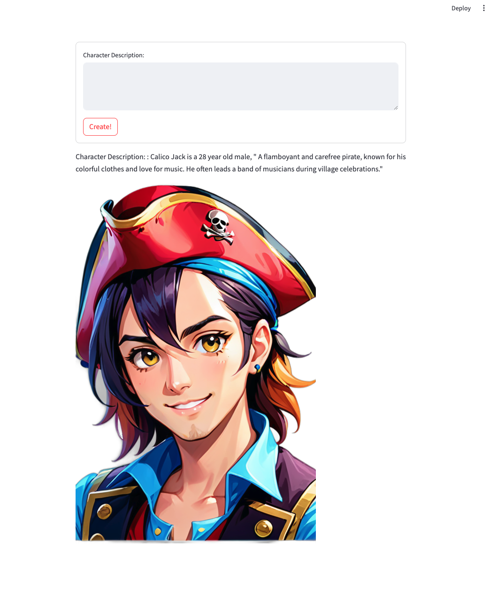

# StableDiffusionCharacterCreator
Use generative AI to create characters for your projects

This app uses Stable Diffusion, StreamLit, and Python to create and easy-to-use interface for creating character profile images.

Type in a short description, and it will generate a character profile image and remove the background:



## Setup Stable Diffusion

1. Follow the steps to setup a local instance of Stable Diffusion:
https://github.com/AUTOMATIC1111/stable-diffusion-webui

2. Make sure to use the --api flag when running the web server:
```
./webui.sh --api
```

3. Download your models and put them in the correct place. The example here is using blue_pencil-XL, some other good models are DreamShaper and CyberRealistic

Or skip all that and find an instance of Stable Diffusion running out in the wild and hook up to it in the app.py file

## Running the software

1. Clone this repo

2. Install all the python dependencies with pip by running the terminal command `pip3 install -r requirements.txt`

3. Use the "run and debug" button in VSCode to start the app OR In your terminal use the command `streamlit run app.py`

4. Type in a short description into the txt box and hit the "Create!" button. Hint: Stable Diffusion works best with short, comma separated values. "female, pirate, red hair" will give much better & consistent results than the plain english "Female pirate with red hair". 

5. Go get a cup of coffee

6. Enjoy the generated profile pic! 

The images created by Stable Diffusion are stored in the `sdresults` folder, and images with background removed are stored in `nobackground`
